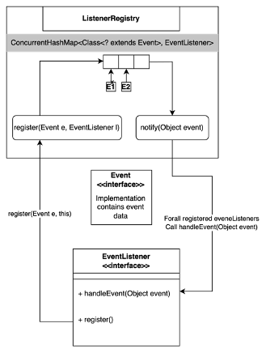

# Table of Contents

[1. Introduction](#introduction)

[2. Design and Development](#design-and-development)

[2.1. UI Design](#ui-design)

[2.2. Database Design](#database-design)

[2.3. Implementation Details](#implementation-details)

[3. Testing and Faults](#testing-and-faults)

[Appendix A. User flow](#appendix-a.-user-flow)

[Appendix B. Whitebox testing](#appendix-b.-whitebox-testing)

# Introduction

The Java-based London Musical Ticket System for musical concert ticket
sales is a user-friendly GUI program developed using NetBeans IDE that
lets users search for musicals by name, select shows, and order tickets
using an interactive calendar. The application connects with an embedded
database for data persistence and retrieval at the backend. The
system\'s architecture prioritised data management and usability to
simplify ticket purchasing. Searching for musicals, viewing show times,
and selecting different types of tickets are backed by a powerful
backend that handles data transactions and interfaces with a database.
In the consecutive chapters the system\'s design, development process,
and functions, as well as white-box testing methodologies for code
dependability and performance are described in brief.

# Design and Development

The overall design and development process of the desktop GUI
application for musicals ticket booking using JDK 17 is discussed below
in brief.

## 2.1. UI Design

The London Musical Ticketing system's GUI is designed with user
interactivity and ease of use in mind. Following is the breakdown of
components designed with respective to the requirement they try to
fulfil

### Start as new user

New user's phone number is used to identify the user so, the UI shown in
Figure 1 captures user's phone number.

### Browse and Search Musicals

To allow browsing and searching musicals, two components are created
Figure 2 shows the musical component that shows the musical's image,
title, theatre and duration.

And, Figure 3 shows the search component that allows user to input
search text to search the musicals by title/description.

### View musical details

To view the musical details the Musical Component shown in Figure 2 is
reused and extended with a scrollable description as shown below in

### Choose musical date and time

One of the major features of the system is choosing a date and time for
a musical, to achieve that two components are created: Calendar
component and time-selector component. The calendar component is
composed up of multiple sub-components which is shown in the Figure 5.
Each cell is clickable and clicking them shows the respective timeslots
in the time slot selector.

Calendar controls component

### Choose ticket types and count

After selecting the date and time, user should be allowed to choose the
number of tickets and type of the ticket they want. At the same time, it
is necessary to make the price visible.

Figure 6 shows the components that builds the accounting component that
allows choosing ticket types and shows the total price of the tickets.
The user can use a purchase button to purchase the tickets they
selected.

### Purchase ticket

After purchasing the ticket user will get the summary of their ticket
and the option to print out the ticket as shown in the Figure 7.

## 2.2. Database Design

The ER diagram below shows the database designed for the musical
ticketing system. The database is made up of 5 entities: Musicals,
Customers, Tickets, ShowTimes and Ticket_Types.

Customers gets created when first-time user enters their phone number in
the system. After that, the customer can browse and search musicals
stored in the Musicals table. The Musicals table is related with Show
Times as a musical can have multiple showtimes. A Customer buys ticket
means that the Customer purchases a ticket for a single showtime, and
the ticket can have one or multiple ticket types.

## 2.3. Implementation Details

The codebase is architected as shown in the Figure 9 below. Gradle is
used as the build automation tool, where it also provides dependency
management features. Dependencies used in the application are: HicariCP
-- Creates and manages connection pools for JDBC, Apache Derby --
Library that provides the driver class for JDBC to connect to Apache
Derby database, Flatlaf -- Library that provides FlaghtLightLaf look and
feel used in the application and SLF4J -- Library that provides logging
support for the application.

The application stores data like musicals, showtimes, and tickets in an
Apache derby database, the JDBC connection to the database is wrapped by
HicariCP which manages connection pool for us. It keeps fixed size of
pool active at any time to be used by the application and after
performing operations on the database the connection is again returned
to the pool. Besides, database the application use disk to store the
images of musicals, the path to the images in the disk is stored in the
database under Musicals table. The SQL files and CSV file in the
resources folder is used to populate the database initially with
musicals and showtimes. Overall, the java classes or source code is
organized inside the package "org.musical.ticketing", details of the
codebase is discussed below:

### Domain

The java records inside the package "org.musical.ticketing.domain" are
the records that models the database entities. The class diagram in
Figure 10 shows how the records inside the domain packages are
organized. All of the database model records implement an generic
interface named Domain that has the methods: getColumns() \-- Get the
column names for select query, map() -- Map from ResultSet obtained
after query to respective domain object, tableName() -- returns the name
of the table represented by the domain record, setPreparedStatement() --
Sets the preparedStatement used to query database with the properties of
the domain record's instance, getInsertQueryPlaceHolders() -- returns
the placeholders for setting in a preparedStatement.

### Views

The package "org.musical.ticketing.view" contains the classes for the
UI. The views use only one JFrame which is named MainFrame, and rest of
the UI are the JPanel. Utilizing card layout on MainFrame each panel are
flipped when they are needed to be seen in the screen. Which panels to
show and which to hide are determined by the event-based architecture
shown in the figure below:

The figure can be well understood with a flow where the CalendarView
implements the EventListener and overrides the handleEvent and register
methods. The register method contains calls to ListenerRegistry class'
static register method to register CalendarCellClicked -- contains the
clicked cell data, TimeSlotSelected -- contains the selected time slot
data and CurrentYearMonthChanged -- Calendar navigated to next month by
user, where each of the event are self-descriptive of what they do.
Similarly, the handle method contains the code to show/update respective
panel in response to those events, e.g. on CalendarCellClicked event
respective showtimes on that day is fetched from the database and
populated in the TicketTimeSlotPane JPanel. Now, whenever MouseClicked
event registers in the CalendarCell component it calls the
ListenerRegistry class' notify method with CalendarCellClicked event,
then the registry calls the handleEvent method of the CalendarView
class. In this way the event-based architecture is utilized to show
timeslots available for each selected day in the calendar.

### Repositories

The package "org.musical.ticketing.repositories" holds the classes that
contains the methods to query the database, each domain model has their
counterpart as a repository in this package. The classes inside this
package are often referred as repository classes all inherit
DomainRepository interface which provides the common methods like
selecting the data by its id from database, selecting all data from a
certain table and inserting new record of the domain in the database.

### Services

The package "org.musical.ticketing.service" contains two classes
CustomerService and MusicalsService. The service classes are responsible
for performing operations with the data in the database using the
repositories classes. For example, MusicalsService provides method to
search musicals.

### Utils

The package "org.musical.ticketing.util" contains the classes that are
categorized as utility classes. For example, the class with method to
obtain images from the disk, the class to initialize the database and
connection pools, classes to format the date and time, and the classes
to show error panes resides inside this package.

# Testing and Faults

A comprehensive testing was performed after the musical ticketing
system's development was completed. To be more specific white-box
testing was performed focusing on the unit logic in the code and the
working of those units together to achieve a feature. Each feature
visible in the UI and not visible in the UI are rigorously tested, for
which the testing table is shown in the Appendix B. The table covers the
testing of some important features like user creation, phone number
validations, musicals searching, calendar's interactivity features,
ticket selection and purchase, and other miscellaneous things like DB
connectivity, date time formatting, and proper navigations. Most of the
tests were successful which highlighted the application's ability to
notify users when there is error in the input or expected action was not
performed.

However, there were notable failures as well. A critical failure was
that the users were allowed to choose tickets more than the available
seat count. Expectation was to notify user when the seat count is
exhausted and show the correct price for total seats selected. This
fault prevents users from correctly progressing to purchase ticket. This
failure was caught during the testing and thus fixed in the application
code. After the fix if the available seat count is exhausted and user
again tries to select a seat, they are notified with an error popup.
Another issue related to the similar feature is that whenever user
selects ticket and decides to change date, then the selected tickets are
not cleared causing the application to show available seats without
decreasing the already selected tickets. Expectation here is to clear
the selected tickets. This is a known issue in the system which needs to
be fixed, but it is not critical compared to the previously discussed
error.

Overall, the testing has shown that the application meets all the
requirements and failing only on some cases. The insights obtained from
the testing was valuable to optimize the application as the process
allowed to thoroughly examine the codebase. Each method and the logic
behind functionalities were thoroughly explored to create test cases
that actually is useful to assess the quality and reliability of the
application.

# Appendix A. User flow

The flow chart below shows how a user progress in the application from
entering their phone number to purchasing a ticket.

And, the figure below shows the 3-step process of purchasing a ticket
for the musical of user choice. Number 1 is to enter phone number,
number 2 is to browse/search for musicals and select one, number 3 is to
select the showtime using interactive calendar and selecting ticket
types, and finally purchase the ticket.

# Appendix B. Whitebox testing

The table shows the Whitebox testing conducted for the London musical
ticketing system.

|ID|Action|Class|Method|Input|Expected|Actual|Status|
|:----|:----|:----|:----|:----|:----|:----|:----|
|1|Input valid phone number and click continue|CustomerStartPanel|startCustomerBtnMouseClicked|746756281|Open browse page|Open browse page|Pass|
|2|Input 12-digit phone number and click continue|CustomerStartPanel|startCustomerBtnMouseClicked|8.92837E+11|Error popup|Error popup|Pass|
|3|Input non-numeric phone number and click continue|CustomerStartPanel|startCustomerBtnMouseClicked|xsauija1728|Error popup|Error popup|Pass|
|4|Press search with empty input|SearchComponent|searchButtonMouseClicked| |All musicals shown|All musicals shown|Pass|
|5|Press search with non-empty non-existent musical name|SearchComponent|searchButtonMouseClicked|not_present|Show no musicals|Show no musicals|Pass|
|6|View musicals|MusicalsService|getAllMusicals| |All musicals shown|All musicals shown|Pass|
|7|Click a musical while browsing|BriefMusicalComponent|formMouseClicked| |Open musical details page|Open musical details page|Pass|
|8|Select a calendar cell|CalendarCell|formMouseClicked|Select Dec 14, 2023|Selected date set to Dec 14, 2023|Selected date set to Dec 14, 2023|Pass|
|9|Select a calendar cell to see show times|CalendarView|handleEvent(CalendarCellClicked)|Select Dec 15, 2023|3 timeslots shown|3 timeslots shown|Pass|
|10|Select a showtime|TicketTimeSlotPane|timeSlotSelected|Select 11:00 -- 13:00|Selected showtime: 11:00 -- 13:00|Selected showtime: 11:00 -- 13:00|Pass|
|11|Select a showtime to see available seats|CalendarView|handleEvent(TimeSlotSelected)|Select 15:00 -- 17:00|remaining seats: 30|remaining seats: 30|Pass|
|12|Select adult seats|AccountingPage|updateTicketCountAndPrice|31 adult seats selected|Error popup|Error popup|Pass|
|13|Press calendar next month button|CalendarControlsPanel|nextMonthButtonMouseClicked|current month: Dec 2023|month shown: Jan 2024|month shown: Jan 2024|Pass|
|14|Press calendar next year button|CalendarControlsPanel|nextYearButtonMouseClicked|current year: 2023|year shown: 2024|year shown: 2024|Pass|
|15|Select senior ticket|AccountingPane|updateTicketCountAndPrice|1 senior ticket selected|Total price: 150|Total price: 150|Pass|
|16|Change date after tickets selected|CalendarCell|formMouseClicked| |Total price updated|Total price is not updated|Fail|
|17|Click purchase with no tickets selected|AccountingPane|purchaseButtonMouseClicked| |Error popup|Error popup|Pass|
|18|Click purchase with valid tickets selected|AccountingPane|purchaseButtonMouseClicked| |Open ticket summary|Open ticket summary|Pass|
|19|Click back button from musical details|MusicalDetailsPane|backToSearchButtonMouseClicked| |Open browse page|Open browse page|Pass|
|20|Input valid phone number and click continue|CustomerStartPanel|startCustomerBtnMouseClicked|746756826|customer in db with 0746756826|customer in db with 0746756826|Pass|
|21|Get musical by id|MusicalsService|findById|5|show musical id 5|show musical id 5|Pass|
|22|Get musical columns|Musical|getColumns| |id,title,description,theatre_name,|id,title,description,theatre_name,|Pass|
| | | | | |duration_in_seconds, thumbnail_image_url|duration_in_seconds, thumbnail_image_url| |
|23|Get ticket table name|Ticket|tableName| |tickets|tickets|Pass|
|24|Get ticket type placeholders|TicketType|getInsertQueryPlaceHolders| |?,?,?|?,?,?|Pass|
|25|Test database connected|DBConnection|getConnection| |live connection|live connection|Pass|
|26|Get only one DBConnection instance|DBConnection|instance|get instance 3 times|same instance 3 times|same instance 3 times|Pass|
|27|Format date to printable date|DateTimeUtils|formatPrintableDate|12/12/2023|December 12, 2023|December 12, 2023|Pass|
